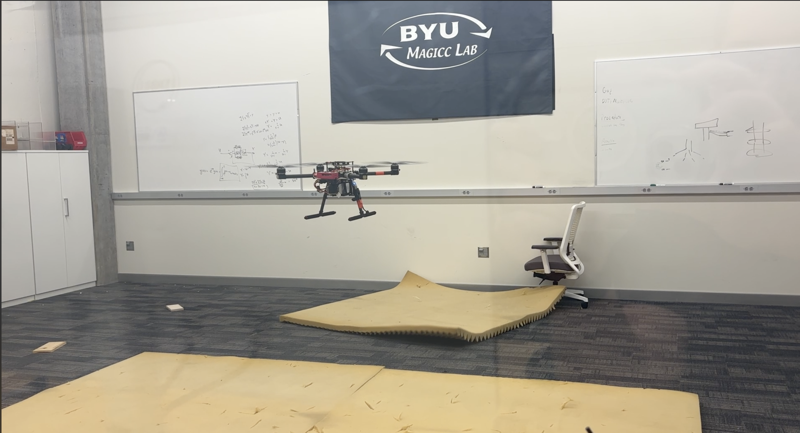

# Veloxity Documentation

Veloxity is a Rust rewrite of the flight controller firmware for ROSflight. Veloxity handles the firmware-level responsibilities of an autopilot, including real time sensor ingestion/processing, state estimation, control, motor mixing, actuator output, parameter management, and MAVLink communication.

This software is being developed for compatibility with the ROSflight ecosystem. The goal of this firmware is to maintain functional parity with, and be a 1:1 substitute for the C firmware while simultaneously taking advantage of the safety Rust offers. As far as the rest of the stack is concerned, the C and Rust firmware are identical.

We offer a software and a hardware path to get started. In simulation, Veloxity connects to the existing ROSflight and ROS 2 tooling through a software-in-the-loop interface. Linux is recommended. On hardware, we provide support for the Pixracer Pro/STM32H7, Nucleo-H753ZI, and experimental support for the RP2350/Pico 2 W.

Because support for the Pico 2 W is experimental, we have chosen to omit including links to it's documentation on this website. Interested readers will find organized markdowns inside the Rust workspace folder structure detailing our current progress.

## Reader Paths

### I Want To Understand The Repository or Modify Firmware Logic

1. [Repository map](repository-map.md)
2. [Build and tool commands](build-and-tools.md)
3. [Feature flags](features.md)
4. [Core architecture](architecture-guide.md)

### I Want To Run The Simulator

1. [Veloxity with the ROSflight Simulator](tutorials/sim_devpod.md)

<!-- 2. [Veloxity ROScopter sim end-to-end](tutorials/veloxity-roscopter-sim-end-to-end.md) -->

### I Want To Work On Hardware

1. [Board bring-up guide](boards/README.md)
2. [STM32 board guide](boards/stm32.md)

<!-- 3. [Hardware experiment 2 ROScopter startup](tutorials/hardware-exp2-roscopter-startup.md) -->
<!-- 4. [Pico 2 W wiring](pico2w-esc-imu-pinout.md) -->
